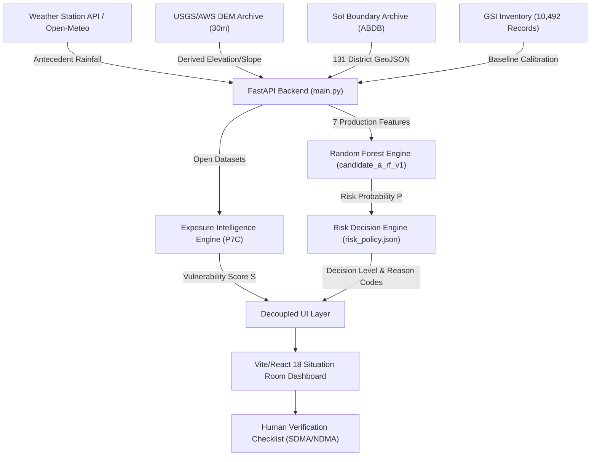

# NexSolve — SIH Technical Summary Architecture Document

**System Title**: NexSolve Landslide Risk Intelligence & Decision Support Platform  
**Target Scope**: 8 Northeastern States of India (131 Official Survey of India Districts)  
**System Architecture**: Microservice-ready FastAPI Backend + Vite/React 18 Situation Room Dashboard  

---

## 1. System Architecture Overview

---

## 2. Component Specifications

### A. Spatial Administrative Framework
- **Source**: Official Survey of India (ABDB LGD Integrated) Administrative Boundaries.
- **Scope**: 8 Northeastern States (Arunachal Pradesh, Assam, Manipur, Meghalaya, Mizoram, Nagaland, Sikkim, Tripura) comprising **131 Official Districts**.
- **Role**: Primary spatial polygon and centroid matching framework. OpenStreetMap (OSM) serves as contextual base-map only.

### B. Machine Learning Engine
- **Active Model ID**: `candidate_a_rf_v1` (Version 1.1.0).
- **Artifact SHA-256**: `1acad34e85b53df0cb68e5e81cd81d68066c4173792e65a51288b35557ba0f72`.
- **Feature Contract (Strict 7 Features)**:
  1. `latitude`: Spatial coordinate
  2. `longitude`: Spatial coordinate
  3. `rainfall_1d`: 24-hour antecedent rainfall (mm)
  4. `rainfall_3d`: 3-day cumulative antecedent rainfall (mm)
  5. `rainfall_7d`: 7-day cumulative antecedent rainfall (mm)
  6. `month_sin`: Seasonal sine encoding ($\sin(2\pi m / 12)$)
  7. `month_cos`: Seasonal cosine encoding ($\cos(2\pi m / 12)$)
- **Validation**: Evaluated on uncontaminated temporal holdout dataset (~0.9206 ROC-AUC, ~0.9328 PR-AUC, ~0.8258 F1, ~0.119 Brier, ~0.059 ECE).

### C. Central Risk & Alert Decision Engine
- **Policy Version**: `1.0.0-PROTOTYPE` (`risk_policy.json`).
- **Internal Thresholds**: `0.35` (Elevated / Yellow), `0.50` (Warning / Orange), `0.75` (Emergency / Red).
- **Safety Gating**: Missing rainfall inputs return `risk_level = "DATA_UNAVAILABLE"`, `risk_probability = null`, `confidence = "UNAVAILABLE"`. Stale weather feeds trigger confidence downgrade and `WEATHER_FEED_STALE` reason code.
- **Warning Authority**: `is_official_warning = false` hardcoded across all responses.

### D. Exposure & Vulnerability Intelligence (P7C)
- **Framework**: 5 domain indicators (Demographic, Socio-Economic, Healthcare, School Infrastructure, Transport Corridors).
- **Data Coverage**: 16 districts profiled with scored vulnerability profiles (8 COMPUTED, 8 PARTIAL); 115 districts remain `INSUFFICIENT_DATA` with score `null`.
- **Decoupling Rule**: Hazard Risk ($P \in [0, 1]$) and Vulnerability Score ($S \in [0, 100]$) are 100% computationally separate.

### E. Explainability Engine (P8)
- **Model-Level Importance**: 24h Rain (23.3%), 3d Rain (22.9%), 7d Rain (22.5%), Spatial/Seasonal (~31.3%).
- **Local Attribution Flag**: `local_explanation_available = false` to prevent unverified SHAP approximations.

### F. Situation Room Frontend & Deployment
- **Frontend Stack**: Vite 5, React 18, Leaflet GIS, Lucide icons, dark enterprise UI.
- **Deployment**: Production `Dockerfile`, `frontend/Dockerfile`, `docker-compose.yml`, `.env.example`, and `GET /api/ready` readiness probe.

---

## 3. Automated Test Suite Summary

- **Total Test Cases**: 150 backend unit tests across 15 test modules (`backend/test_*.py`).
- **Pass Rate**: 150 / 150 PASS (100% OK).
- **Frontend Build**: `npm run build` PASS (0 errors, 169ms).
